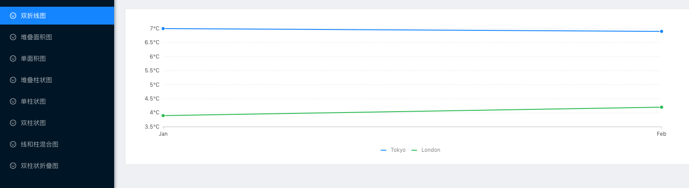

<!--
 * @Description: In User Settings Edit
 * @Author: your name
 * @Date: 2019-08-13 14:54:59
 * @LastEditTime: 2019-08-13 14:59:19
 * @LastEditors: Please set LastEditors
 -->

# Antv 使用 ts+react 实践

包括多个图表

## Environment Prepare

Install `node_modules`:

```bash
yarn
```

### Start project

```bash
yarn start
```

### Build project

```bash
npm run build
```

### 折线图


