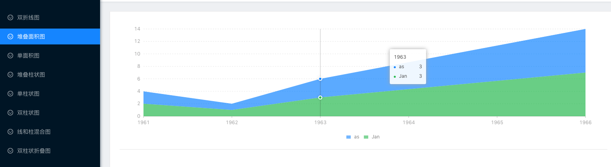
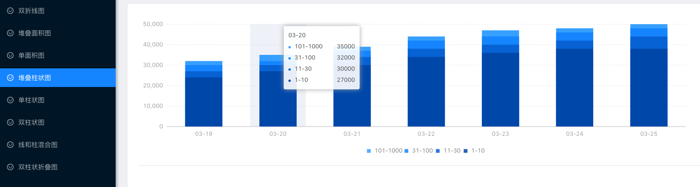
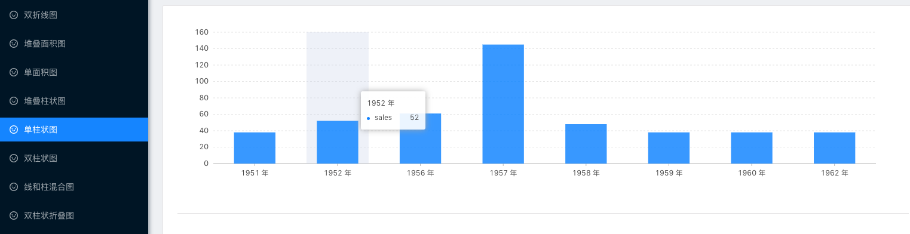
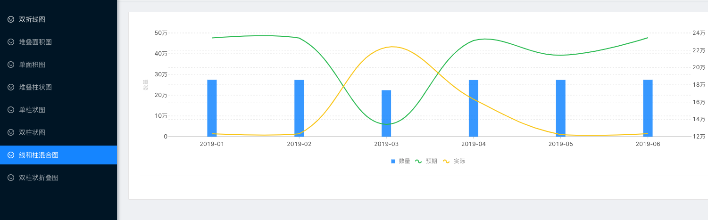
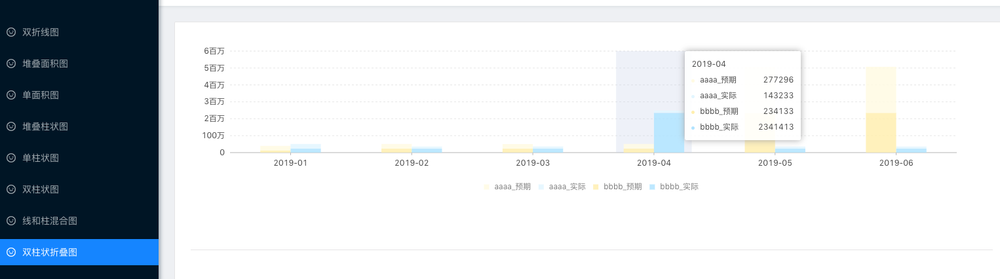
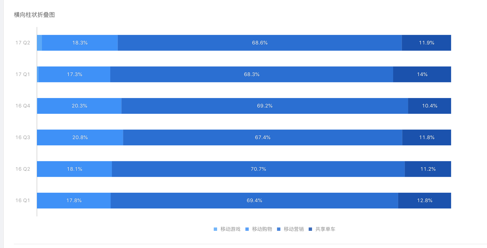

<!--
 * @Description: In User Settings Edit
 * @Author: your name
 * @Date: 2019-08-13 14:54:59
 * @LastEditTime : 2020-02-03 15:12:18
 * @LastEditors  : Please set LastEditors
 -->

# Antv 使用 ts+react 实践

包括多个图表

## Environment Prepare

Install `node_modules`:

```bash
cnpm install
```

### Start project

```bash
npm start
```

### Build project

```bash
npm run build
```

### 折线图


### 堆叠面积图



### 单面积图


### 堆叠柱状图



### 单柱状图



### 双柱状图


### 折线和柱状混合图



### 双柱状折叠图



### 横向柱状折叠图


